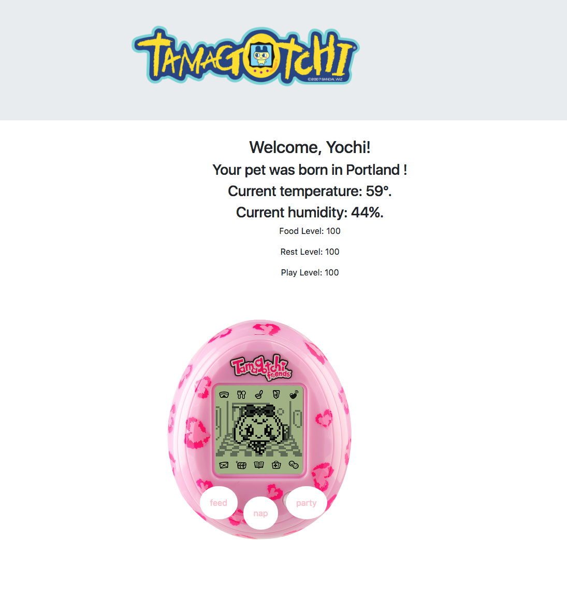

# Tamagotchi

#### _By Maggie Summers, Kaila Goff_

#### _An application where users can play with a tamagotchi character by feeding it, playing with it, and having it take a nap. 3-20-18_

<kbd></kbd>

## Description

_Users are able to create a new Tamagotchi and give it a name. They are also able to add a birthplace to their Tamagotchi. Once that information is entered, the user is welcomed by name and given the temperature and humidity of their Tamagotchi birthplace. The user is then able to play the game._

### Specifications
    1. User creates a Tamagotchi.

    2. User creates a birthplace for Tamagotchi.

    3. User adds food to Tamagotchi by clicking feed button.

    4. User adds sleep to Tamagotchi by clicking the nap button.

    5. User adds play to Tamagotchi by clicking the party button.

## Setup/Installation Requirements

   * Install npm dependencies with `$npm install`

   * Build, start, and open the project with `$npm start`

## Known Bugs

  * _No known bugs at this time._

## Support and Contact Details

  _To suggest changes, contact me through GitHub._

## Technologies Used

    * HTML
    * JavaScript
    * jQuery
    * Bootstrap

## Dev environment built with

   * npm
   * webpack
   * jasmine
   * karma
   * babel
   * Giphy API
   * OpenWeatherMap API

### License

MIT License

Copyright (c) 2018 **Maggie Summers, Kaila Goff**
